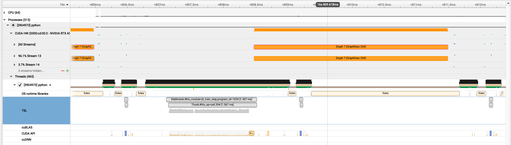

# Fusion Fail



## What are we looking at ?

The function `train_step` corresponds to a forward and backward pass through a 3 layered [NequIP](https://www.nature.com/articles/s41467-022-29939-5) model implemented using [e3nn-jax](https://github.com/e3nn/e3nn-jax) acting on a simple Tetris dataset. Thanks @ameya98 for the code !

## What's happening ?

Here's a brief summary of the under the hood story:

- [XLA](https://github.com/openxla/xla) is unable to pattern match or generate a couple of fused kernels for the compuatation. Instead its left with around ~300 kernels that it needs to execute at runtime (small chunks below `Thunk:#hlo_op` in the `TSL` row)

- This makes the compiler fall back to [CUDAGraphs](https://developer.nvidia.com/blog/cuda-graphs/) which batches the execution of these kernels. However, the execution graph needs to be updated with new inputs at runtime (~30% runtime overhead before `Graph 7` is launched on the GPU). This overhead (notice the `CUDA API` row) increases with the size of the computation graph.

### Packages

```bash
pip install requirements.txt
```

To reproduce the profile shown above install NVIDIA Nsight Systems and run

```bash
nsys profile -w true -t cuda,nvtx,osrt,cudnn,cublas -s cpu -o nequip_profile -f true --cudabacktrace=true -x true python train.py
```

## TODO

- [ ] Add a MLP-equivalent to show what non-CUDAGraph fusion should look like
